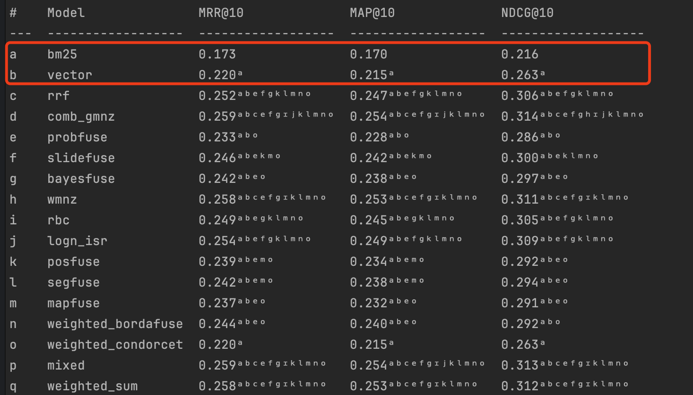

## Ranx 在 MyScale 中 fusion 的应用

### 不同 Fusion 策略结果对比


### ranx 应用注意事项

针对归一化，需要注意 vector search 结果的特殊性，vector search 在使用 Cosine 距离计算时是从小到大排序, 
所以在 min-max 归一化时需要使用下述策略:
```python
normalized_results[doc_id] = (max_score - results[doc_id]) / (denominator)
```

ranx 并未直接提供这种策略，ranx 会默认 score 越大越相关, repo 中仿照 ranx 提供了 min_max_inverted 归一化函数。
也可以使用 rank 归一化，避免分数排序方式的影响。